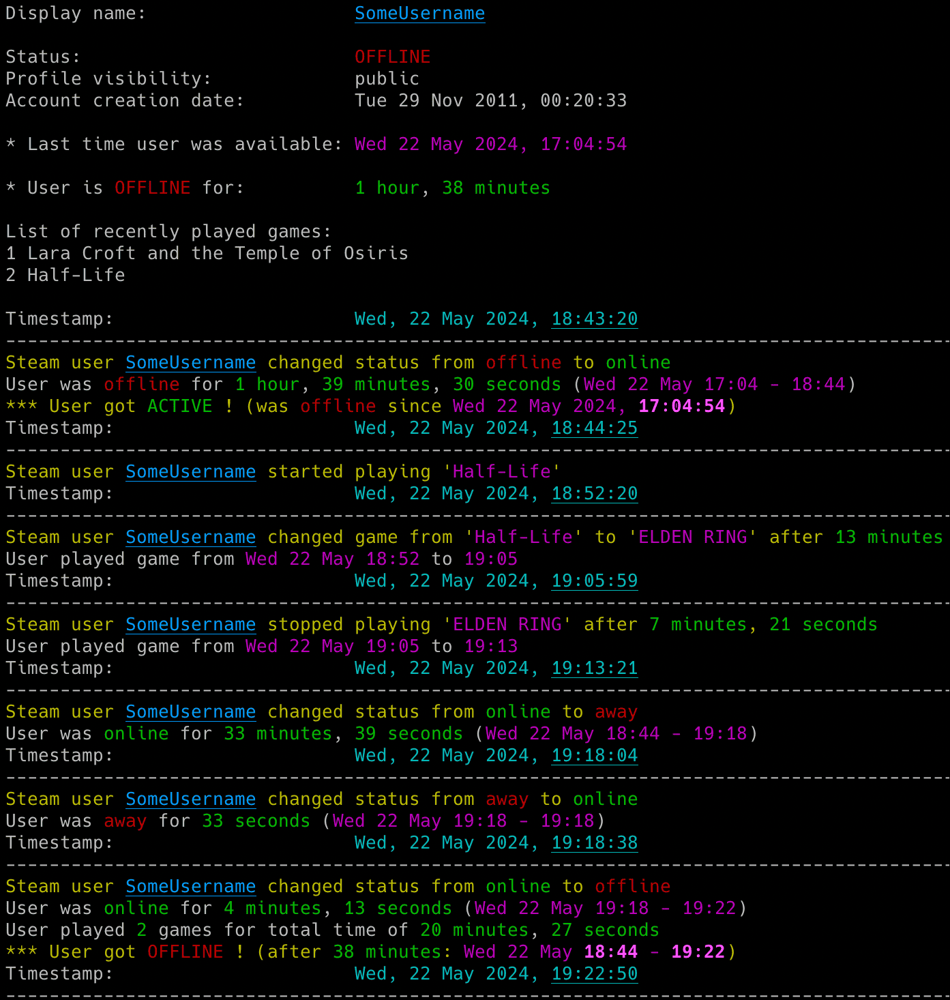

# steam_monitor

steam_monitor is a Python tool which allows for real-time monitoring of Steam players activities. 

## Features

- Real-time tracking of Steam users gaming activity (including detection when user gets online/offline or played games)
- Basics statistics for user activity (how long in different states, how long played game, overall time and number of played games in the session etc.)
- Email notifications for different events (player gets online/away/snooze/offline, starts/finishes/changes game, errors)
- Saving all user activities with timestamps to the CSV file
- Possibility to control the running copy of the script via signals

<p align="center">
   
</p>

## Change Log

Release notes can be found [here](RELEASE_NOTES.md)

## Disclaimer

I'm not a dev, project done as a hobby. Code is ugly and as-is, but it works (at least for me) ;-)

## Requirements

The tool requires Python 3.5 or higher.

It uses [steam](https://github.com/ValvePython/steam) library, also requests and python-dateutil.

It has been tested successfully on:
- macOS (Ventura & Sonoma)
- Linux:
   - Raspberry Pi Bullseye & Bookworm
   - Ubuntu 24
   - Kali Linux 2024
- Windows (10 & 11)

It should work on other versions of macOS, Linux, Unix and Windows as well.

## Installation

Install the required Python packages:

```sh
python3 -m pip install requests python-dateutil "steam[client]"
```

Or from requirements.txt:

```sh
pip3 install -r requirements.txt
```

Copy the *[steam_monitor.py](steam_monitor.py)* file to the desired location. 

You might want to add executable rights if on Linux/Unix/macOS:

```sh
chmod a+x steam_monitor.py
```

## Configuration

Edit the *[steam_monitor.py](steam_monitor.py)* file and change any desired configuration variables in the marked **CONFIGURATION SECTION** (all parameters have detailed description in the comments).

### Steam Web API key

You can get the Steam Web API key here: [http://steamcommunity.com/dev/apikey](http://steamcommunity.com/dev/apikey)

Change the **STEAM_API_KEY** variable to respective value (or use **-u** parameter).

### User privacy settings

In order to monitor Steam user activity, proper privacy settings need to be enabled on the monitored user account, i.e. in *'Edit Profile'* -> *'Privacy Settings'*, the value in section *'My Profile'* and *'Game details'* should be set to *'Friends Only'* (if you are friends) or to *'Public'*. 

### SMTP settings

If you want to use email notifications functionality you need to change the SMTP settings (host, port, user, password, sender, recipient) in the *[steam_monitor.py](steam_monitor.py)* file. If you leave the default settings then no notifications will be sent.

You can verify if your SMTP settings are correct by using **-z** parameter (the tool will try to send a test email notification):

```sh
./steam_monitor.py -z
```

### Other settings

All other variables can be left at their defaults, but feel free to experiment with it.

## Getting started

### List of supported parameters

To get the list of all supported parameters:

```sh
./steam_monitor.py -h
```

or 

```sh
python3 ./steam_monitor.py -h
```

### Monitoring mode

To monitor specific user activity, just type the player's Steam64 ID (**76561198116287247** in the example below):

```sh
./steam_monitor.py 76561198116287247
```

If you have not changed **STEAM_API_KEY** variable in the *[steam_monitor.py](steam_monitor.py)* file, you can use **-u** parameter:

```sh
./steam_monitor.py 76561198116287247 -u "your_steam_web_api_key"
```

If you do not know the user's Steam64 ID, but you know the Steam profile/community URL (which can be customized by the user), you can also run the tool with **-r** parameter which will automatically resolve it to Steam64 ID: 

```sh
./steam_monitor.py -r "https://steamcommunity.com/id/misiektoja/"
```

The tool will run infinitely and monitor the player until the script is interrupted (Ctrl+C) or killed the other way.

You can monitor multiple Steam players by spawning multiple copies of the script. 

It is suggested to use sth like **tmux** or **screen** to have the script running after you log out from the server (unless you are running it on your desktop).

The tool automatically saves its output to *steam_monitor_{user_steam64_id}.log* file (the log file name suffix can be changed via **-y** parameter or logging can be disabled completely with **-d** parameter).

The tool also saves the timestamp and last status (after every change) to *steam_{user_display_name}_last_status.json* file, so the last status is available after the restart of the tool.

## How to use other features

### Email notifications

If you want to get email notifications once the user gets online or offline use **-a** parameter:

```sh
./steam_monitor.py -r "https://steamcommunity.com/id/misiektoja/" -a
```

Make sure you defined your SMTP settings earlier (see [SMTP settings](#smtp-settings)).

Example email:

<p align="center">
   
</p>

If you want to be informed about any user status changes (online/away/snooze/offline) use **-s** parameter:

```sh
./steam_monitor.py -r "https://steamcommunity.com/id/misiektoja/" -s
```

If you want to be informed when user starts, stops or changes the played game then use **-g** parameter:

```sh
./steam_monitor.py -r "https://steamcommunity.com/id/misiektoja/" -g
```

### Saving gaming activity to the CSV file

If you want to save all reported activities of the Steam user, use **-b** parameter with the name of the file (it will be automatically created if it does not exist):

```sh
./steam_monitor.py -r "https://steamcommunity.com/id/misiektoja/" -b steam_misiektoja.csv
```

### Check intervals

If you want to change the check interval when the user is online/away/snooze to 15 seconds use **-k** parameter and when the user is offline to 2 mins (120 seconds) use **-c** parameter:

```sh
./steam_monitor.py -r "https://steamcommunity.com/id/misiektoja/" -k 15 -c 120
```

### Controlling the script via signals (only macOS/Linux/Unix)

The tool has several signal handlers implemented which allow to change behavior of the tool without a need to restart it with new parameters.

List of supported signals:

| Signal | Description |
| ----------- | ----------- |
| USR1 | Toggle email notifications when user gets online or offline (-a) |
| USR2 | Toggle email notifications when user starts/stops/changes the game (-g) |
| CONT | Toggle email notifications for all user status changes (online/away/snooze/offline) (-s) |
| TRAP | Increase the check timer for player activity when user is online/away/snooze (by 30 seconds) |
| ABRT | Decrease check timer for player activity when user is online/away/snooze (by 30 seconds) |

So if you want to change functionality of the running tool, just send the proper signal to the desired copy of the script.

I personally use **pkill** tool, so for example to toggle email notifications when user gets online or offline, for the tool instance monitoring the *76561198116287247* user:

```sh
pkill -f -USR1 "python3 ./steam_monitor.py 76561198116287247"
```

As Windows supports limited number of signals, this functionality is available only on Linux/Unix/macOS.

### Other

Check other supported parameters using **-h**.

You can combine all the parameters mentioned earlier.

## Coloring log output with GRC

If you use [GRC](https://github.com/garabik/grc) and want to have the tool's log output properly colored you can use the configuration file available [here](grc/conf.monitor_logs)

Change your grc configuration (typically *.grc/grc.conf*) and add this part:

```
# monitoring log file
.*_monitor_.*\.log
conf.monitor_logs
```

Now copy the *conf.monitor_logs* to your *.grc* directory and steam_monitor log files should be nicely colored when using *grc* tool.

## License

This project is licensed under the GPLv3 - see the [LICENSE](LICENSE) file for details
